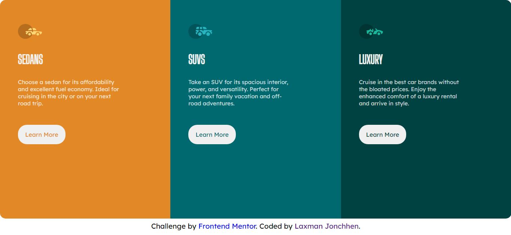

# Frontend Mentor - 3-column preview card component solution

This is a solution to the [3-column preview card component challenge on Frontend Mentor](https://www.frontendmentor.io/challenges/3column-preview-card-component-pH92eAR2-). Frontend Mentor challenges help you improve your coding skills by building realistic projects. 

## Table of contents

- [Overview](#overview)
  - [The challenge](#the-challenge)
  - [Screenshot](#screenshot)
  - [Links](#links)
- [My process](#my-process)
  - [Built with](#built-with)
  - [What I learned](#what-i-learned)
  - [Continued development](#continued-development)
- [Author](#author)

## Overview

### The challenge

Users should be able to:

- View the optimal layout depending on their device's screen size
- See hover states for interactive elements

### Screenshot

### Links

- Solution URL: [Github](https://github.com/LaxmanJonchhen12/3-Column-Preview-Card-Challenge)
- Live Site URL: [Netlify](https://3columnlaxman.netlify.app/)

## My process

I started the challenge by analyzing the design then i started the challenge with 
mobile first approach and then completed the desktop version.

### Built with

- Semantic HTML5 markup
- CSS custom properties
- Flexbox
- Mobile-first workflow

### What I learned

I learned mobile first workflow from this challenge.

### Continued development

I would like to continue to work on my responsive design skills and CSS skills.

## Author

- Website - [LaxmanJonchhen](https://laxmanjonchhen12.github.io/)
- Frontend Mentor - [@LaxmanJonchhen12](https://www.frontendmentor.io/profile/LaxmanJonchhen12)
- Twitter - [@LaxmanJonchhen5](https://twitter.com/LaxmanJonchhen5)
